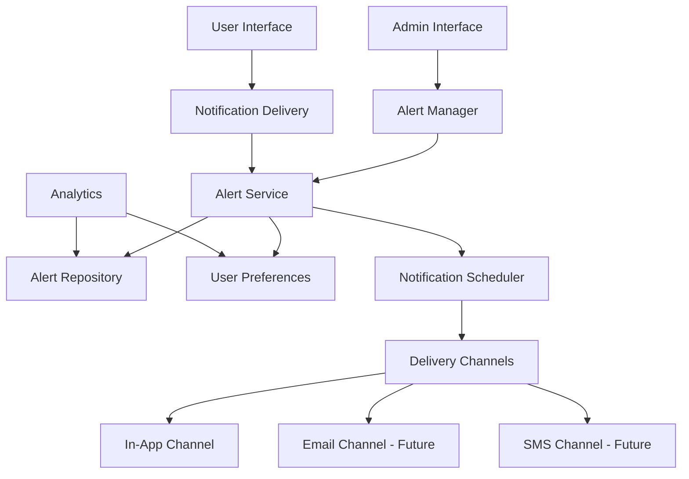

# Design Document

## Overview

The Alerting & Notification Platform is designed as a modular, extensible system using object-oriented principles and design patterns. The architecture separates concerns between alert management, notification delivery, user preferences, and analytics while ensuring scalability and maintainability.

## Architecture

### High-Level Architecture



### Core Design Patterns

1. **Strategy Pattern**: For notification delivery channels (In-App, Email, SMS)
2. **Observer Pattern**: For user subscriptions to alerts based on visibility rules
3. **State Pattern**: For managing alert states (active, snoozed, expired, read/unread)
4. **Repository Pattern**: For data access abstraction
5. **Factory Pattern**: For creating notification delivery strategies

## Components and Interfaces

### Alert Management Layer

#### Alert Entity
```typescript
interface Alert {
  id: string;
  title: string;
  message: string;
  severity: AlertSeverity;
  deliveryType: DeliveryType;
  visibility: VisibilityConfig;
  startTime: Date;
  expiryTime: Date;
  reminderEnabled: boolean;
  reminderFrequency: number; // hours
  createdBy: string;
  createdAt: Date;
  status: AlertStatus;
}

enum AlertSeverity {
  INFO = 'info',
  WARNING = 'warning',
  CRITICAL = 'critical'
}

enum AlertStatus {
  ACTIVE = 'active',
  EXPIRED = 'expired',
  ARCHIVED = 'archived'
}
```

#### Visibility Configuration
```typescript
interface VisibilityConfig {
  type: VisibilityType;
  targetIds: string[]; // organization, team, or user IDs
}

enum VisibilityType {
  ORGANIZATION = 'organization',
  TEAM = 'team',
  USER = 'user'
}
```

#### Alert Service
```typescript
interface IAlertService {
  createAlert(alert: CreateAlertRequest): Promise<Alert>;
  updateAlert(id: string, updates: UpdateAlertRequest): Promise<Alert>;
  archiveAlert(id: string): Promise<void>;
  getAlerts(filters: AlertFilters): Promise<Alert[]>;
  getAlertById(id: string): Promise<Alert>;
}
```

### Notification Delivery Layer

#### Delivery Strategy Interface
```typescript
interface IDeliveryStrategy {
  deliver(notification: Notification, user: User): Promise<DeliveryResult>;
  getChannelType(): DeliveryType;
}

interface Notification {
  alertId: string;
  userId: string;
  title: string;
  message: string;
  severity: AlertSeverity;
  timestamp: Date;
}
```

#### Notification Scheduler
```typescript
interface INotificationScheduler {
  scheduleReminder(alertId: string, userId: string, nextReminderTime: Date): Promise<void>;
  cancelReminders(alertId: string, userId: string): Promise<void>;
  processScheduledReminders(): Promise<void>;
}
```

#### Delivery Channel Implementations
```typescript
class InAppDeliveryStrategy implements IDeliveryStrategy {
  async deliver(notification: Notification, user: User): Promise<DeliveryResult> {
    // Implementation for in-app notifications
  }
  
  getChannelType(): DeliveryType {
    return DeliveryType.IN_APP;
  }
}

class EmailDeliveryStrategy implements IDeliveryStrategy {
  async deliver(notification: Notification, user: User): Promise<DeliveryResult> {
    // Future implementation for email notifications
  }
  
  getChannelType(): DeliveryType {
    return DeliveryType.EMAIL;
  }
}
```

### User Preferences Layer

#### User Alert State
```typescript
interface UserAlertState {
  userId: string;
  alertId: string;
  isRead: boolean;
  isSnoozed: boolean;
  snoozeUntil?: Date;
  lastDelivered?: Date;
  deliveryCount: number;
  createdAt: Date;
  updatedAt: Date;
}

interface IUserPreferenceService {
  markAsRead(userId: string, alertId: string): Promise<void>;
  markAsUnread(userId: string, alertId: string): Promise<void>;
  snoozeAlert(userId: string, alertId: string): Promise<void>;
  getUserAlertStates(userId: string): Promise<UserAlertState[]>;
  getAlertState(userId: string, alertId: string): Promise<UserAlertState>;
}
```

### User and Team Management

#### User Entity
```typescript
interface User {
  id: string;
  name: string;
  email: string;
  teamId: string;
  organizationId: string;
  isActive: boolean;
}

interface Team {
  id: string;
  name: string;
  organizationId: string;
  memberIds: string[];
}
```

### Analytics Layer

#### Analytics Service
```typescript
interface IAnalyticsService {
  getTotalAlertsCreated(): Promise<number>;
  getDeliveryMetrics(): Promise<DeliveryMetrics>;
  getSnoozeMetrics(): Promise<SnoozeMetrics>;
  getSeverityBreakdown(): Promise<SeverityMetrics>;
}

interface DeliveryMetrics {
  totalDelivered: number;
  totalRead: number;
  readRate: number;
}

interface SnoozeMetrics {
  alertId: string;
  alertTitle: string;
  totalSnoozes: number;
  uniqueUsersWhoSnoozed: number;
}
```

## Data Models

### Database Schema Design

#### Alerts Table
```sql
CREATE TABLE alerts (
  id VARCHAR(36) PRIMARY KEY,
  title VARCHAR(255) NOT NULL,
  message TEXT NOT NULL,
  severity ENUM('info', 'warning', 'critical') NOT NULL,
  delivery_type ENUM('in_app', 'email', 'sms') NOT NULL,
  visibility_type ENUM('organization', 'team', 'user') NOT NULL,
  target_ids JSON NOT NULL,
  start_time TIMESTAMP NOT NULL,
  expiry_time TIMESTAMP NOT NULL,
  reminder_enabled BOOLEAN DEFAULT TRUE,
  reminder_frequency INT DEFAULT 2,
  created_by VARCHAR(36) NOT NULL,
  created_at TIMESTAMP DEFAULT CURRENT_TIMESTAMP,
  status ENUM('active', 'expired', 'archived') DEFAULT 'active',
  INDEX idx_status_expiry (status, expiry_time),
  INDEX idx_visibility (visibility_type, target_ids(255))
);
```

#### User Alert States Table
```sql
CREATE TABLE user_alert_states (
  id VARCHAR(36) PRIMARY KEY,
  user_id VARCHAR(36) NOT NULL,
  alert_id VARCHAR(36) NOT NULL,
  is_read BOOLEAN DEFAULT FALSE,
  is_snoozed BOOLEAN DEFAULT FALSE,
  snooze_until TIMESTAMP NULL,
  last_delivered TIMESTAMP NULL,
  delivery_count INT DEFAULT 0,
  created_at TIMESTAMP DEFAULT CURRENT_TIMESTAMP,
  updated_at TIMESTAMP DEFAULT CURRENT_TIMESTAMP ON UPDATE CURRENT_TIMESTAMP,
  UNIQUE KEY unique_user_alert (user_id, alert_id),
  FOREIGN KEY (alert_id) REFERENCES alerts(id) ON DELETE CASCADE,
  INDEX idx_user_alerts (user_id, alert_id),
  INDEX idx_snooze_check (is_snoozed, snooze_until)
);
```

#### Notification Delivery Log Table
```sql
CREATE TABLE notification_deliveries (
  id VARCHAR(36) PRIMARY KEY,
  alert_id VARCHAR(36) NOT NULL,
  user_id VARCHAR(36) NOT NULL,
  delivery_type ENUM('in_app', 'email', 'sms') NOT NULL,
  status ENUM('pending', 'delivered', 'failed') NOT NULL,
  delivered_at TIMESTAMP NULL,
  error_message TEXT NULL,
  created_at TIMESTAMP DEFAULT CURRENT_TIMESTAMP,
  FOREIGN KEY (alert_id) REFERENCES alerts(id) ON DELETE CASCADE,
  INDEX idx_delivery_status (status, created_at),
  INDEX idx_alert_deliveries (alert_id, user_id)
);
```

#### Scheduled Reminders Table
```sql
CREATE TABLE scheduled_reminders (
  id VARCHAR(36) PRIMARY KEY,
  alert_id VARCHAR(36) NOT NULL,
  user_id VARCHAR(36) NOT NULL,
  scheduled_time TIMESTAMP NOT NULL,
  status ENUM('pending', 'processed', 'cancelled') DEFAULT 'pending',
  created_at TIMESTAMP DEFAULT CURRENT_TIMESTAMP,
  processed_at TIMESTAMP NULL,
  FOREIGN KEY (alert_id) REFERENCES alerts(id) ON DELETE CASCADE,
  INDEX idx_scheduled_time (scheduled_time, status),
  INDEX idx_user_reminders (user_id, alert_id)
);
```

## Error Handling

### Error Types and Handling Strategy

#### Custom Exception Classes
```typescript
class AlertNotFoundError extends Error {
  constructor(alertId: string) {
    super(`Alert with ID ${alertId} not found`);
    this.name = 'AlertNotFoundError';
  }
}

class InvalidVisibilityError extends Error {
  constructor(message: string) {
    super(message);
    this.name = 'InvalidVisibilityError';
  }
}

class DeliveryFailureError extends Error {
  constructor(channel: string, reason: string) {
    super(`Delivery failed for ${channel}: ${reason}`);
    this.name = 'DeliveryFailureError';
  }
}
```

#### Error Handling Middleware
```typescript
interface ErrorHandler {
  handleError(error: Error, context: string): Promise<void>;
}

class NotificationErrorHandler implements ErrorHandler {
  async handleError(error: Error, context: string): Promise<void> {
    // Log error with context
    // Implement retry logic for transient failures
    // Send alerts to administrators for critical failures
  }
}
```

### Retry and Resilience Patterns

1. **Exponential Backoff**: For failed notification deliveries
2. **Circuit Breaker**: For external service dependencies
3. **Dead Letter Queue**: For permanently failed notifications
4. **Graceful Degradation**: Continue core functionality when non-critical services fail

## Testing Strategy

### Unit Testing Approach

#### Test Coverage Areas
1. **Alert Service Logic**: CRUD operations, validation, business rules
2. **Notification Delivery**: Strategy pattern implementations, delivery logic
3. **User Preferences**: State management, snooze logic, read/unread tracking
4. **Reminder Scheduling**: Timing calculations, scheduling logic
5. **Analytics**: Metric calculations, data aggregation

#### Mock Strategy
```typescript
interface MockDeliveryStrategy extends IDeliveryStrategy {
  deliveryResults: DeliveryResult[];
  deliveryCalls: Array<{notification: Notification, user: User}>;
}

class TestNotificationScheduler implements INotificationScheduler {
  scheduledReminders: Array<{alertId: string, userId: string, time: Date}>;
  // Mock implementation for testing
}
```

### Integration Testing

#### Test Scenarios
1. **End-to-End Alert Flow**: Create alert → Deliver to users → Handle user interactions
2. **Reminder Processing**: Schedule reminders → Process at correct times → Handle snooze logic
3. **Visibility Rules**: Test organization, team, and user-level targeting
4. **Analytics Accuracy**: Verify metrics match actual user interactions

### Performance Testing

#### Load Testing Scenarios
1. **High Alert Volume**: Test system with thousands of concurrent alerts
2. **Large User Base**: Verify performance with 10,000+ users
3. **Reminder Processing**: Test scheduler performance with many pending reminders
4. **Analytics Queries**: Ensure dashboard remains responsive under load

#### Performance Metrics
- Alert creation response time < 200ms
- Notification delivery latency < 1 second
- Reminder processing batch size optimization
- Database query performance monitoring

### Security Testing

#### Security Considerations
1. **Authorization**: Verify users only see alerts they're authorized to view
2. **Input Validation**: Prevent injection attacks in alert content
3. **Rate Limiting**: Prevent abuse of alert creation and user actions
4. **Data Privacy**: Ensure user preferences and analytics respect privacy requirements

## Implementation Notes

### Reminder Logic Implementation

The reminder system uses a combination of scheduled jobs and database-driven state management:

1. **Reminder Scheduling**: When an alert is created, calculate initial reminder times for all target users
2. **Batch Processing**: Process reminders in batches to handle high volume efficiently  
3. **State Checking**: Before sending reminders, verify alert is still active and user hasn't snoozed
4. **Next Reminder Calculation**: After successful delivery, schedule the next reminder (2 hours later)

### Snooze Logic Implementation

Daily snooze reset is handled through:

1. **Snooze Until Timestamp**: Set to end of current day when user snoozes
2. **Daily Reset Check**: Reminder processor checks if snooze period has expired
3. **Automatic Resume**: If alert is still active after snooze expiry, resume normal reminder schedule

### Extensibility Considerations

The design supports future enhancements through:

1. **Plugin Architecture**: New delivery channels can be added without core changes
2. **Configuration-Driven**: Reminder frequencies and visibility rules can be made configurable
3. **Event-Driven**: System can be extended with event sourcing for audit trails
4. **API-First**: All functionality exposed through REST APIs for integration flexibility